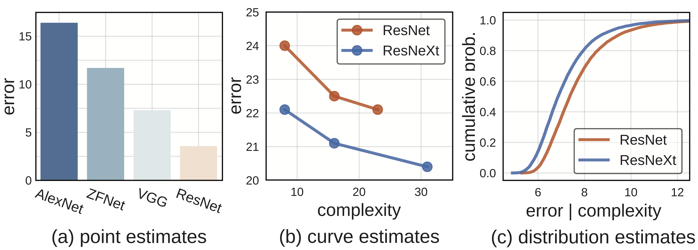

# On Network Design Spaces for Visual Recognition

This repository provides the code and data used in the [On Network Design Spaces for Visual Recognition](https://arxiv.org/abs/1905.13214) work, including full training statistics for *over 100,000 models* spanning multiple model families.

<div align="center">
  
  <p align="left"><b>Comparing networks.</b> (a) Early work on neural networks for visual recognition tasks used <i>point estimates</i> to compare architectures, often <i>irrespective of model complexity</i>. (b) More recent work compares <i>curve estimates</i> of error <i>vs.</i> complexity traced by a handful of selected models. (c) We propose to <i>sample</i> models from a parameterized model design space, and measure <i>distribution estimates</i> to compare design spaces. This methodology allows for a more complete and unbiased view of the design landscape.</p>
</div>

## Getting Started

Data is available for download [here](https://dl.fbaipublicfiles.com/nds/data.zip). We provide notebooks to reproduce all figures from the paper, that serve as examples of how to use the data and apply our methodology. All models were trained using [pycls](https://github.com/facebookresearch/pycls).

## Citation

If you use the code or data in your research, please use the following BibTex entry:

```
@InProceedings{Radosavovic2019,
  title = {On Network Design Spaces for Visual Recognition},
  author = {Radosavovic, Ilija and Johnson, Justin and Xie, Saining and Lo, Wan-Yen and Doll{\'a}r, Piotr},
  booktitle = {ICCV},
  year = {2019}
}
```

## License

The code is released under the MIT license. Please see the [LICENSE](LICENSE) file for more information.
